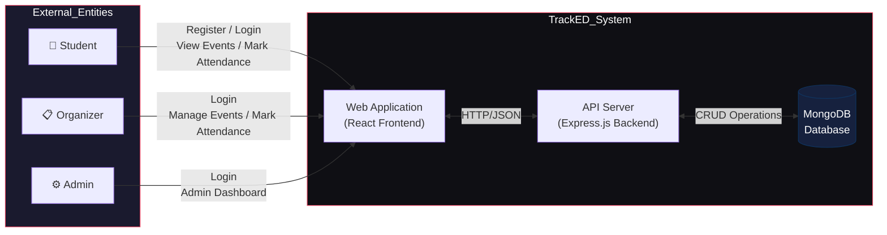

# TrackED - System Context Diagram



## System Boundary

The **TrackED System** encompasses:
- **Frontend**: React 19 + Vite + Tailwind CSS (port 5173)
- **Backend**: Express.js + Mongoose (port 5000)
- **Database**: MongoDB (127.0.0.1:27017)

## External Entities Description

| Entity | Role | Interactions |
|--------|------|-------------|
| **Student** | End user | Register, login, view events, mark attendance |
| **Organizer** | Event manager | Login, create events, view attendees, update attendance status |
| **Admin** | System manager | Login, create organizers, manage users, view reports, manage events |

## Data Flow with External Entities

```
┌─────────────────────────────────────────────────────────────────────────────┐
│                           TRACKED SYSTEM                                     │
│  ┌─────────────────┐         ┌─────────────────┐         ┌─────────────────┐│
│  │   STUDENT       │         │   ORGANIZER     │         │   ADMIN        ││
│  │                 │         │                 │         │                 ││
│  │ • Register      │         │ • Create Event  │         │ • Create User  ││
│  │ • Login          │         │ • Edit Event    │         │ • Delete User  ││
│  │ • View Events    │         │ • Delete Event  │         │ • View Reports ││
│  │ • Mark Attendance│         │ • View Attendees│         │ • Manage Events││
│  │ • View My History│         │ • Update Status  │         │ • Manage Users ││
│  └────────┬────────┘         └────────┬────────┘         └────────┬────────┘│
│           │                             │                             │        │
└───────────┼─────────────────────────────┼─────────────────────────────┼────────┘
            │                             │                             │
            ▼                             ▼                             ▼
    ┌───────────────────────────────────────────────────────────────────────────┐
    │                         REACT FRONTEND                                     │
    │  ┌─────────────┐  ┌─────────────┐  ┌─────────────┐  ┌─────────────┐  │
    │  │ Auth Pages   │  │Student Pages│  │Org Dashboard │  │Admin Dashboard│ │
    │  └──────┬──────┘  └──────┬──────┘  └──────┬──────┘  └──────┬──────┘  │
    └─────────┼─────────────────┼─────────────────┼─────────────────┼──────────┘
              │                 │                 │                 │
              └─────────────────┴────────┬────────┴─────────────────┘
                                         │
                                         ▼
    ┌───────────────────────────────────────────────────────────────────────────┐
    │                         EXPRESS API BACKEND                                │
    │  ┌─────────────┐  ┌─────────────┐  ┌─────────────┐  ┌─────────────┐   │
    │  │ Auth Routes │  │Event Routes │  │Report Routes│  │ Admin Routes│   │
    │  └──────┬──────┘  └──────┬──────┘  └──────┬──────┘  └──────┬──────┘   │
    └─────────┼─────────────────┼─────────────────┼─────────────────┼───────────┘
              │                 │                 │                 │
              └─────────────────┴────────┬────────┴─────────────────┘
                                         │
                                         ▼
                              ┌─────────────────────┐
                              │     MONGODB         │
                              │                     │
                              │  • Users Collection │
                              │  • Events Collection│
                              │  • Attendance Coll. │
                              └─────────────────────┘
    ```

## Trust Boundaries

| Boundary | Description |
|----------|-------------|
| **Client-Side** | JWT validation, role-based routing, UI state |
| **Server-Side** | Route protection, authorization middleware, business logic |
| **Database** | Schema validation, unique indexes, data integrity |

## Communication Protocols

- **Frontend ↔ Backend**: REST API over HTTP (JSON)
- **Backend ↔ Database**: MongoDB native driver (Mongoose ODM)
- **Authentication**: JWT Bearer tokens
