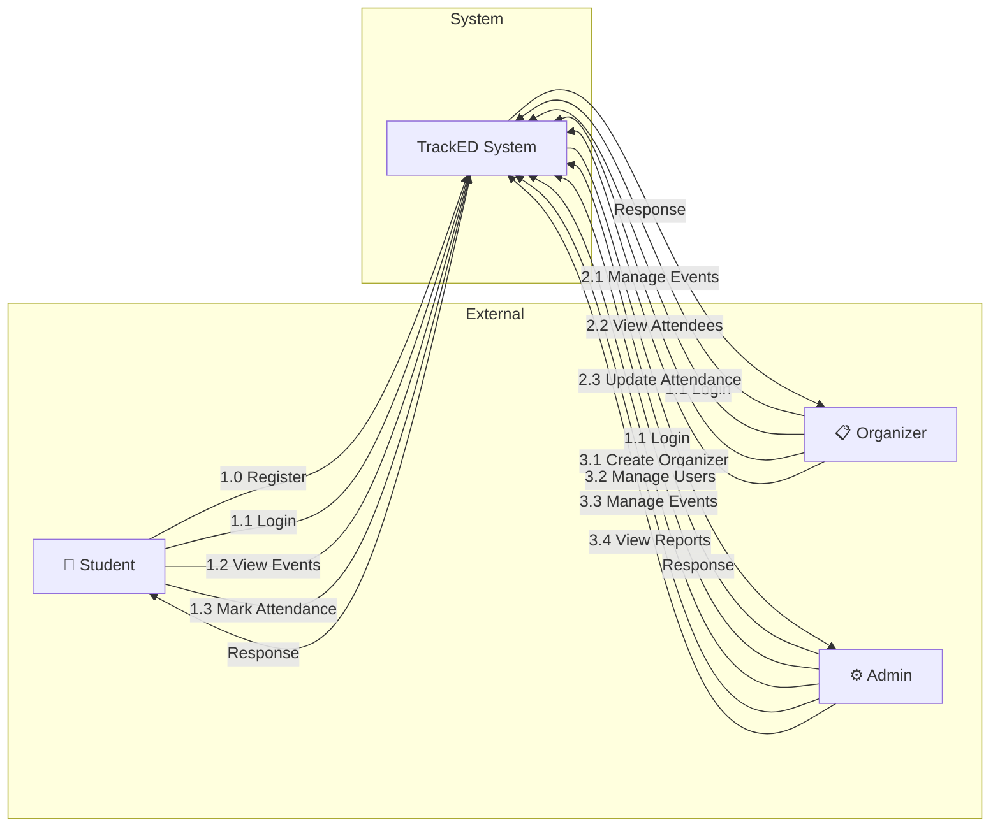
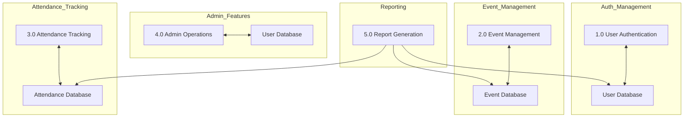

# TrackED - Data Flow Diagram (DFD)

## Level 0: Context Diagram



---

## Level 1: Main Processes



---

## Process Specifications

### 1.0 User Authentication

| Aspect | Description |
|--------|-------------|
| **Inputs** | Email, Password, Role (for registration) |
| **Outputs** | JWT Token, User Role, Session Data |
| **Process** | Validate credentials, generate JWT, return user info |
| **Datastore** | Users Collection |
| **Authorization** | Role-based access control |

```
┌─────────────────────────────────────────────┐
│           1.0 USER AUTHENTICATION           │
│                                             │
│  INPUT:                     OUTPUT:          │
│  ┌───────────┐             ┌───────────┐   │
│  │ email     │             │ JWT Token │   │
│  │ password  │──────────►   │ role      │   │
│  │ role*     │             │ user info │   │
│  └───────────┘             └───────────┘   │
│                                             │
│  PROCESS:                                   │
│  1. Validate input                         │
│  2. Hash/compare password                  │
│  3. Generate JWT token                     │
│  4. Return user data                       │
│                                             │
│  ERROR: Invalid credentials, User exists   │
└─────────────────────────────────────────────┘
```

---

### 2.0 Event Management

| Aspect | Description |
|--------|-------------|
| **Inputs** | Event details (title, date, time, location, description) |
| **Outputs** | Created/Updated Event, Event List |
| **Process** | Validate, store, update events |
| **Datastore** | Events Collection |
| **Authorization** | Organizer, Admin |

```
┌─────────────────────────────────────────────┐
│           2.0 EVENT MANAGEMENT              │
│                                             │
│  INPUT:                     OUTPUT:         │
│  ┌───────────┐             ┌───────────┐  │
│  │ title     │             │ event     │  │
│  │ date      │──────────►  │ list      │  │
│  │ time      │             │ status    │  │
│  │ location  │             └───────────┘  │
│  │ desc      │                             │
│  └───────────┘                             │
│                                             │
│  PROCESS:                                  │
│  1. Validate event data                   │
│  2. Associate with organizer               │
│  3. Save to database                       │
│  4. Return created event                  │
│                                             │
│  OPERATIONS:                              │
│  • Create Event (POST)                    │
│  • Read Events (GET)                      │
│  • Update Event (PUT)                     │
│  • Delete Event (DELETE)                  │
│  • Update Status (PATCH)                 │
└─────────────────────────────────────────────┘
```

---

### 3.0 Attendance Tracking

| Aspect | Description |
|--------|-------------|
| **Inputs** | Event ID, Student ID, Status |
| **Outputs** | Attendance Record, Statistics |
| **Process** | Mark attendance, update status, calculate rates |
| **Datastore** | Attendance Collection |
| **Authorization** | Student (mark own), Organizer/Admin (update) |

```
┌─────────────────────────────────────────────┐
│         3.0 ATTENDANCE TRACKING            │
│                                             │
│  INPUT:                     OUTPUT:         │
│  ┌───────────┐             ┌───────────┐  │
│  │ event_id  │             │ record    │  │
│  │ student_id│──────────►  │ stats     │  │
│  │ status    │             │ list      │  │
│  └───────────┘             └───────────┘  │
│                                             │
│  PROCESS:                                  │
│  1. Verify event exists                    │
│  2. Check for duplicate                    │
│  3. Create/update attendance               │
│  4. Return updated record                 │
│                                             │
│  STATUS OPTIONS:                           │
│  • present - Student attended              │
│  • absent - Student marked absent          │
│  • pending - Awaiting confirmation        │
└─────────────────────────────────────────────┘
```

---

### 4.0 Admin Operations

| Aspect | Description |
|--------|-------------|
| **Inputs** | User data, Event ID, Action type |
| **Outputs** | Created User, Deleted confirmation |
| **Process** | Create organizers, delete users, manage events |
| **Datastore** | Users, Events, Attendance Collections |
| **Authorization** | Admin only |

```
┌─────────────────────────────────────────────┐
│           4.0 ADMIN OPERATIONS             │
│                                             │
│  CREATE ORGANIZER:                         │
│  INPUT: { name, email, password }          │
│  OUTPUT: { success, organizer_id }        │
│  PROCESS:                                  │
│  1. Validate email uniqueness              │
│  2. Hash password                          │
│  3. Set role to "organizer"                │
│  4. Save to database                       │
│                                             │
│  DELETE USER:                              │
│  INPUT: { user_id }                        │
│  OUTPUT: { success }                      │
│  PROCESS:                                  │
│  1. Verify user exists                     │
│  2. Check not admin                        │
│  3. Delete user                           │
│                                             │
│  MANAGE EVENTS:                           │
│  • Update any event status                │
│  • Delete any event                        │
│  • View all events (including closed)     │
└─────────────────────────────────────────────┘
```

---

### 5.0 Report Generation

| Aspect | Description |
|--------|-------------|
| **Inputs** | Report type, Date range, Filters |
| **Outputs** | Statistics, Charts data, CSV export |
| **Process** | Aggregate data, calculate metrics, format |
| **Datastore** | All collections |
| **Authorization** | Admin only |

```
┌─────────────────────────────────────────────┐
│          5.0 REPORT GENERATION             │
│                                             │
│  REPORT TYPES:                             │
│  ┌────────────────┐                        │
│  │ ATTENDANCE     │ → Present/Absent/Pending │
│  │ EVENTS         │ → Event stats, rates   │
│  │ USERS          │ → Role breakdown       │
│  └────────────────┘                        │
│                                             │
│  PROCESS:                                  │
│  1. Query relevant collections            │
│  2. Aggregate statistics                  │
│  3. Calculate percentages                 │
│  4. Format for charts/tables             │
│  5. Generate CSV if requested             │
│                                             │
│  EXPORT FORMATS:                           │
│  • JSON (API response)                    │
│  • CSV (Downloadable file)                │
└─────────────────────────────────────────────┘
```

---

## Data Stores

```
┌─────────────────────────────────────────────────────────────────┐
│                        DATA STORES                              │
├─────────────────────────────────────────────────────────────────┤
│                                                                 │
│  D1: USERS                                                      │
│  ┌───────────────────────────────────────────────────────────┐  │
│  │ _id: ObjectId                                             │  │
│  │ name: String (required)                                   │  │
│  │ email: String (unique, required)                         │  │
│  │ password: String (hashed)                                │  │
│  │ role: Enum ["student", "organizer", "admin"]             │  │
│  │ createdAt: Date                                           │  │
│  │ updatedAt: Date                                           │  │
│  └───────────────────────────────────────────────────────────┘  │
│                                                                 │
│  D2: EVENTS                                                    │
│  ┌───────────────────────────────────────────────────────────┐  │
│  │ _id: ObjectId                                             │  │
│  │ title: String (required)                                  │  │
│  │ description: String                                       │  │
│  │ date: Date (required)                                     │  │
│  │ time: String                                              │  │
│  │ location: String                                          │  │
│  │ status: Enum ["upcoming", "live", "closed"]               │  │
│  │ organizer: ObjectId (ref: Users)                         │  │
│  │ createdAt: Date                                           │  │
│  │ updatedAt: Date                                           │  │
│  └───────────────────────────────────────────────────────────┘  │
│                                                                 │
│  D3: ATTENDANCE                                                │
│  ┌───────────────────────────────────────────────────────────┐  │
│  │ _id: ObjectId                                             │  │
│  │ event: ObjectId (ref: Events)                            │  │
│  │ student: ObjectId (ref: Users)                          │  │
│  │ status: Enum ["present", "absent", "pending"]           │  │
│  │ attendedAt: Date (default: now)                          │  │
│  │ createdAt: Date                                           │  │
│  │ updatedAt: Date                                           │  │
│  │                                                            │  │
│  │ INDEX: { event: 1, student: 1 } UNIQUE                  │  │
│  └───────────────────────────────────────────────────────────┘  │
│                                                                 │
└─────────────────────────────────────────────────────────────────┘
```

---

## Data Flow Summary

| Flow # | From | To | Data |
|--------|------|-----|------|
| 1 | Student | System | Registration data |
| 2 | Student | System | Login credentials |
| 3 | Student | System | Attendance request |
| 4 | Organizer | System | Event CRUD operations |
| 5 | Organizer | System | Attendance updates |
| 6 | Admin | System | User management |
| 7 | Admin | System | Report requests |
| 8 | System | Student | Event list, attendance confirmation |
| 9 | System | Organizer | Event stats, attendee list |
| 10 | System | Admin | Reports, user list |
